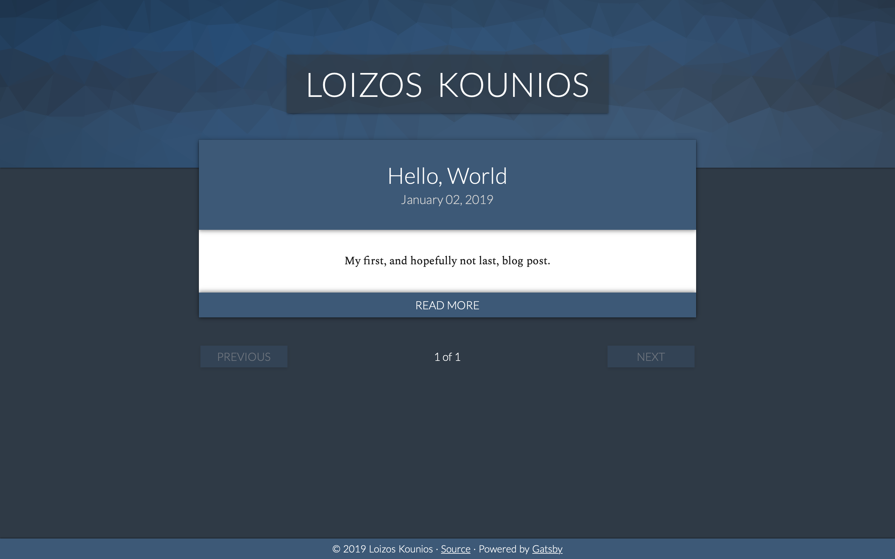

# blog

Source code for my blog, built using the [Gatsby](https://gatsbyjs.org) static site generator.

## Technologies Used

The core technologies used are [React](https://reactjs.org) and [Gatsby](https://gatsbyjs.org).

I used a few different technologies to style this site:

* [normalize.css](https://necolas.github.io/normalize.css/) is used to give a more consistent starting point.
* [Typography.js](https://kyleamathews.github.io/typography.js/) is used to set up the basis for things like font sizes and margins.
* [styled-components](https://www.styled-components.com) is used for a taste of some sweet CSS-in-JS controversy. Oh, and I used it for styling everything else too.

The header / banner uses [Trianglify](https://github.com/qrohlf/trianglify) to generate a new cool background every time it is re-rendered.
The version of Trianglify that's used on this site is [my own fork](https://github.com/louiskounios/trianglify).
The fork removes a lot of the rendering functionality provided by the original library.
I found this to be necessary as Gatsby was not able to bundle static binaries.
Essentially, the fork makes it so I'm provided with the paths for the background and I use those paths in React to generate an `<svg>` component.
A demo site showcasing Trianglify is available [here](https://trianglify.io).

Posts are written in Markdown and converted to HTML using [gatsby-transformer-remark](https://www.gatsbyjs.org/packages/gatsby-transformer-remark/) which uses [remark](https://remark.js.org) under the hood. Code blocks are handled by [Prism](https://prismjs.com) with Solarized Dark as the [theme](https://github.com/michaeljdeeb/prism-solarized-dark).

For typefaces, I'm using
* [Spectral](https://fonts.google.com/specimen/Spectral) as my main font (serif);
* [Lato](https://fonts.google.com/specimen/Lato) as my secondary font used on headings, buttons, etc (sans-serif);
* [Fira Mono](https://fonts.google.com/specimen/Fira+Mono) as the monospace font used in code blocks and inline code.

As a substitute for people telling me how bad my code is, I'm using [ESLint](https://eslint.org) with the [Airbnb ruleset](https://www.npmjs.com/package/eslint-config-airbnb).
