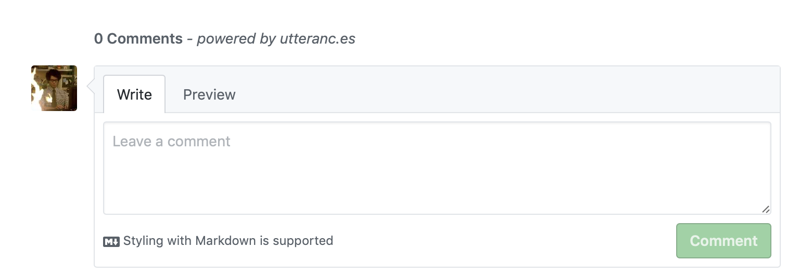
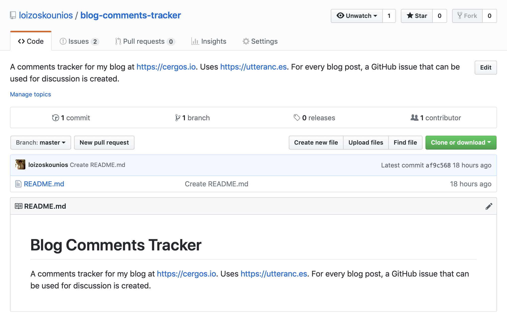
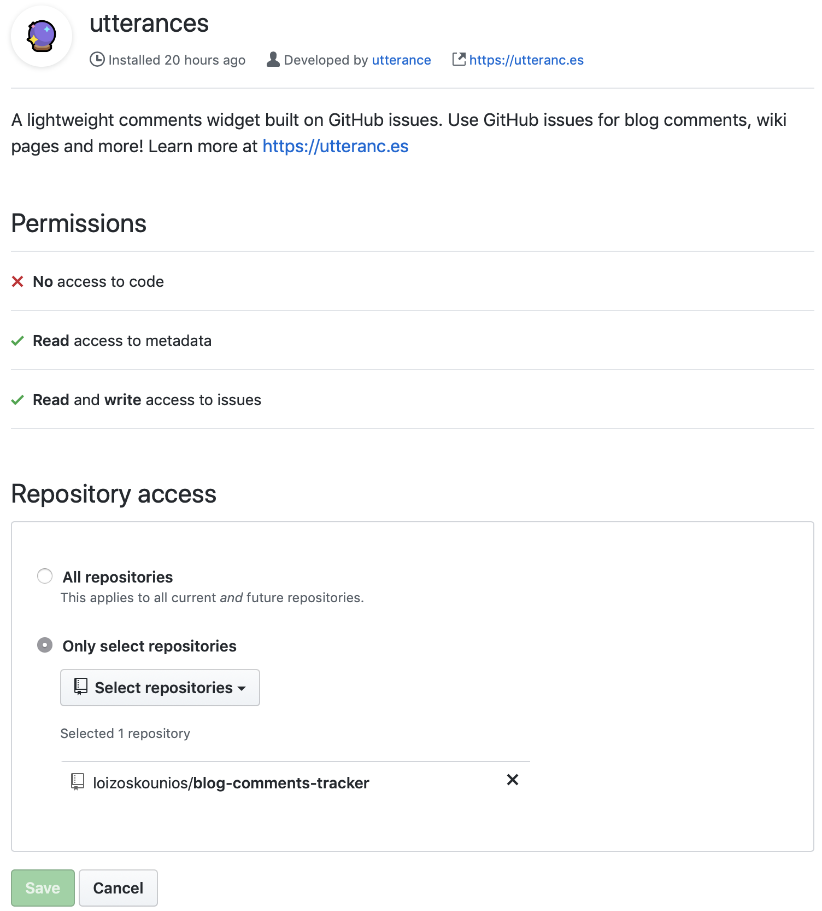
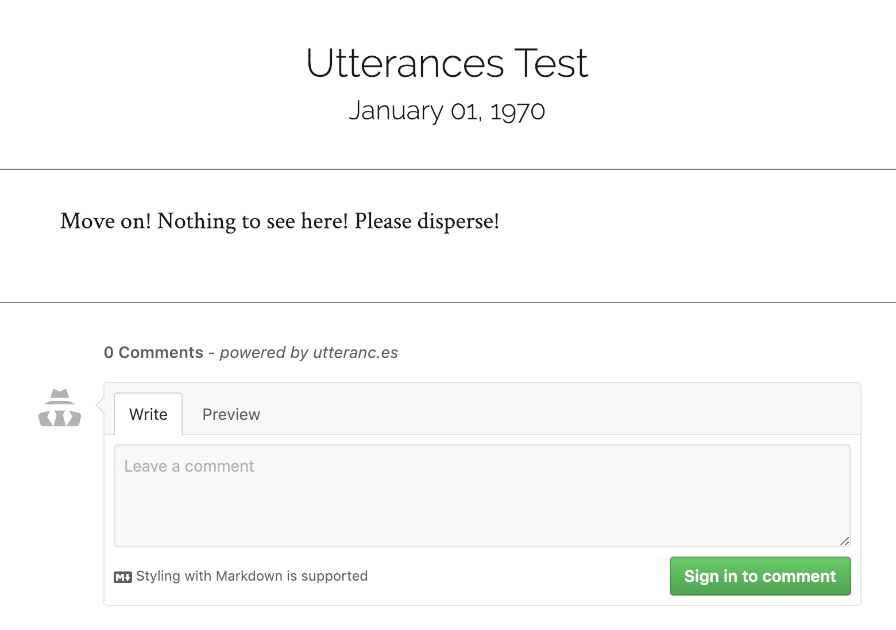

When I was in the final stages of developing my blog, I started looking into the best way to handle comments.
After going through the list of usual suspects (such as [Disqus](https://disqus.com)), I ran into a series of blog posts ([1](http://artsy.github.io/blog/2017/07/15/Comments-are-on/), [2](http://donw.io/post/github-comments/), [3](https://nemethgergely.com/using-github-for-comments-on-your-blog/), and [more](https://www.google.com/search?q=using+github+for+blog+comments)) on the topic of using GitHub for comments.
As I kept digging, I noticed a common pattern in the aforementioned blog posts – people were ditching Disqus for a GitHub solution due to how slow, bloated and privacy-intrusive Disqus is.
I was now convinced that leveraging GitHub was the way to go.

So I started making notes about all the necessary components.
Things like handling the GitHub API rate limits, styling the comments section, automating the process of creating a GitHub issue for every blog post, etc.
And then I ran into [Utterances](https://utteranc.es).

## Utterances

Utterances takes all the hard work you'd have to do to have a GitHub-backed comment section on your blog and packages it into a [GitHub app](https://github.com/apps/utterances).
It is [open source](https://github.com/utterance/utterances) and even comes with a dark theme!
I have already integrated it on this site and can confirm that the entire process is completely painless.
Here is the list of steps I had to take to set it up.

### Created Public GitHub Repository

The first step was to create a public GitHub repository for housing my blog's comments ([here](https://github.com/loizoskounios/blog-comments-tracker)).



### Installed Utterances App

Then I had to install the [Utterances GitHub app](https://github.com/apps/utterances) to the repository I created above.



### Generated Script Tag

I then used the [configuration section on the Utterances website](https://utteranc.es#configuration) to generate the script tag that would later load on my blog. The script in my case was the following:

```javascript
<script src="https://utteranc.es/client.js"
        repo="loizoskounios/blog-comments-tracker"
        issue-term="title"
        theme="github-light"
        crossorigin="anonymous"
        async>
</script>
```

### Loaded the Script

All that was left was for me to load the script into my Gatsby blog.
Luckily, it was fairly easy to set this up in React.

To load the script in React, I had to manually create the script element and append it as a child to some other element.
I used the `document` global to create the script element, and a React `ref` to keep a reference to the component that would house the script element.
This is what I ended up doing, with all extra noise removed (things like Gatsby static queries, styled-components, etc).

```jsx
import React from 'react';

class Comments extends React.Component {
  constructor(props) {
    super(props);

    this.commentsEl = React.createRef();
    this.state = { status: 'pending' };
  }

  componentDidMount() {
    const scriptEl = document.createElement('script');
    scriptEl.onload = () => this.setState({ status: 'success' });
    scriptEl.onerror = () => this.setState({ status: 'failed' });
    scriptEl.async = true;
    scriptEl.src = 'https://utteranc.es/client.js';
    scriptEl.setAttribute('repo', 'loizoskounios/blog-comments-tracker');
    scriptEl.setAttribute('issue-term', 'title');
    scriptEl.setAttribute('theme', 'github-light');
    scriptEl.setAttribute('crossorigin', 'anonymous');
    this.commentsEl.current.appendChild(scriptEl);
  }

  render() {
    const { status } = this.state;

    return (
      <div className="comments-wrapper">
        {status === 'failed' && <div>Error. Please try again.</div>}
        {status === 'pending' && <div>Loading script...</div>}
        <div ref={this.commentsEl} />
      </div>
    );
  }
}

export default Comments;
```

### Final Result

This is the final result in a dummy blog post.


