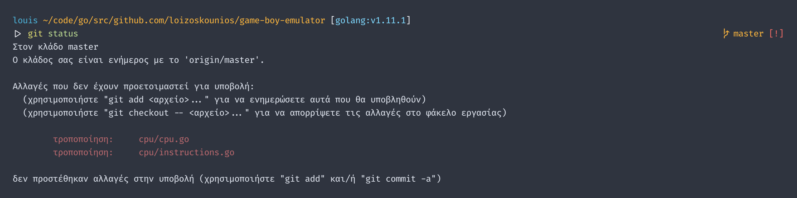
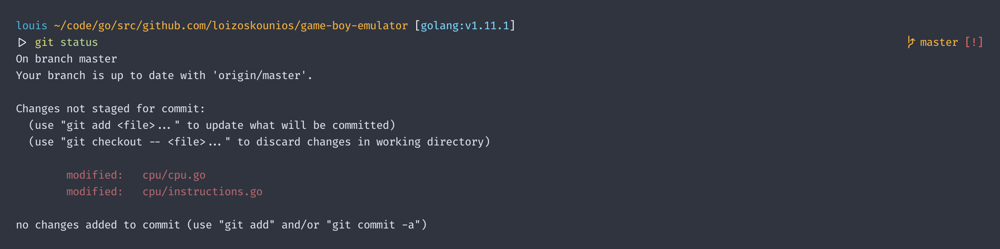

I recently updated Git to v2.21.0 on my Macbook and ran into an issue where Git CLI output was not in English.
In my case, messages were in Greek.

Now, Greek is not a completely random language for me since I'm from Cyprus and I'm bound to have a tucked away configuration mentioning Greek.
But the issue cropped up after a Git update which was weird.
After looking at the usual places (environment variables `LANG`, `LC_ALL`, etc), I found "Greek" listed as one of my preferred languages under the "Language & Region" page in macOS settings.

 in the "Language & Region" settings page')

Despite English being listed as my primary language, removing "Greek" from the list of preferred languages resolved my issue.

Note that the list of preferred languages is completely independent from keyboard inputs, so this did not cost me the ability to type in Greek.
And since I never really use any apps in Greek, removing it from my preferred languages has no actual effect on me.
Simple enough!
